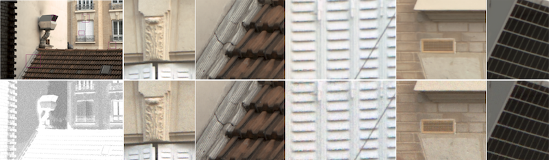

### Optimal transport  

**GMMOT:  Optimal Transport between Gaussian Mixture  Models**:  [Code](https://github.com/judelo/gmmot) – [Paper](https://hal.archives-ouvertes.fr/hal-02178204)

### Image synthesis / abstraction 

* **A generic framework for the structured abstraction of images (with N.Faraj, G-S Xia and Y. Gousseau)**: [Code](https://github.com/nounsse/Image-Abstraction) – [Paper](https://hal.archives-ouvertes.fr/hal-01587259)

* **Realistic Film Grain Rendering (with A. Newson, B. Galerne, N. Faraj)**

    * IPOL [(CODE + ONLINE DEMO)](http://www.ipol.im/pub/art/2017/192/)
    * [CGF paper](https://hal.archives-ouvertes.fr/hal-01520260)
    * [GITHUB](https://github.com/alasdairnewson/film_grain_rendering_ipol) (cpu version) 
    * [GITHUB](https://github.com/alasdairnewson/film_grain_rendering_gpu) (gpu) 
    * [Video Youtube](https://www.youtube.com/embed/Gj4p5cocebc)

### Image restoration and enhancement

* **HDR+ Burst denoising method (with A. Monod and T. Veit)** IPOL [(CODE + ONLINE DEMO)](http://www.ipol.im/pub/art/2021/336/)

* **FastDVDnet: A Very Fast Deep Video Denoising algorithm (with M. Tassano and T. Veit)** [CODE](https://github.com/m-tassano/fastdvdnet) –  [Vidéos](https://www.dropbox.com/sh/m9mpz1m1b55x420/AAAt1wes43brv37BmBxw07jna?dl=0)

* **DVDnet: A Simple and Fast Network for Deep Video Denoising (with M. Tassano and T. Veit)** [CODE](https://github.com/m-tassano/dvdnet) 

* **An Analysis and Implementation of the FFDNet Image Denoising Method. (with M. Tassano and T. Veit)** IPOL [(CODE + ONLINE DEMO)](http://www.ipol.im/pub/art/2019/231/)

* **A Bayesian Hyperprior Approach for Joint Image Denoising and Interpolation (with C. Aguerrebere, A. Almansa, Y. Gousseau and P. Musé)** [WEBPAGE and Code](https://nounsse.github.io/HBE_project/index.html)

* **PARIGI (Patch-based Approach to Remove Impulse-Gaussian Noise from Images) (with T. Guillemot, A. Desolneux))** IPOL [(CODE + ONLINE DEMO)](http://www.ipol.im/pub/art/2016/161/) [GITHUB](https://github.com/tguillemot/parigi)
 
 

 * **Midway Image Equalization (with T. Guillemot)** IPOL [(CODE + ONLINE DEMO)](http://www.ipol.im/pub/art/2016/140/) [GITHUB](https://github.com/tguillemot/midway_equalization)

  

### Image and histogram analysis 

* **Fast Affine Invariant Image Matching, with M. Rodriguez and J-M. Morel.**  IPOL [(CODE + ONLINE DEMO)](http://www.ipol.im/pub/art/2018/225/) [GITHUB](https://github.com/rdguez-mariano/imas_analytics)

  

* **Fine to Coarse Histogram Segmentation** [Paper](http://www.math-info.univ-paris5.fr/~jdelon/Pdf/2007_Histogram_Segmentation_IEEETIP.pdf) [GITHUB](https://github.com/judelo/2007-TIP-HistogramSegmentation)

* **Illuminant Estimation from Projections on the Planckian Locus**  [DEMO](https://etsitpab.github.io/JSM/examples/ppl/ppl.html) by [Baptiste Mazin](https://mazin.wp.imt.fr/) 

### WEBPAGES / VIDEOS (without CODE)

* **Split and Match: Example-based Adaptive Patch Sampling for Unsupervised Style Transfer** [webpage](http://oriel.github.io/style_transfer.html)

  

* **Motion driven tonal stabilization** [webpage](http://oriel.github.io/tonal_stabilization.html)

* **Flicker stabilization in image sequences** [webpage](https://helios2.mi.parisdescartes.fr/~jdelon/demos/Flicker_stabilization/) (see also this [introduction](http://images.math.cnrs.fr/Papillonnage-et-mathematiques-des.html) to the problem, in french)

* **Removing Artefacts From Color and Contrast Modifications** [webpage](http://w3.mi.parisdescartes.fr/~jdelon/demos/artefact_removal_html/)

