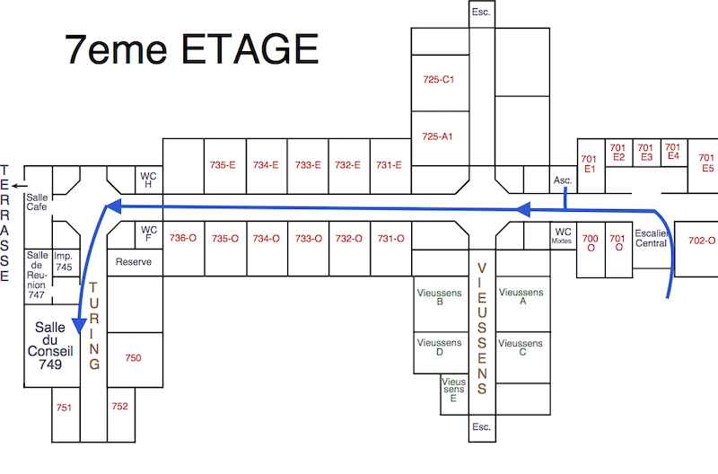

Mon bureau se trouve au 7ème étage du centre universitaire des Saints-Pères.
* Se rendre au 45 rue des Saints-Pères, Paris 6ème (métro “St-Germain des Prés”).
* Entrer dans le bâtiment par l’entrée principale.
* Poursuivre dans le hall puis à droite. Il y a deux ascenseurs sur la gauche, de chaque côté de l’escalier.
* Prendre l’ascenseur jusqu’au 7ème étage (ou les escaliers si vous êtes sportif.ve ou si les ascenseurs ne fonctionnent pas…).
* A la sortie de l’ascenseur prendre à droite (pour les escaliers, prendre à gauche une fois arrivé au 7ème étage).
* Entrer dans le couloir “Matématologie” et aller tout au bout du couloir. Prendre la dernière porte à gauche pour entrer dans l’aile Turing. Mon bureau est au fond à gauche (bureau 752).

Si vous cherchez la salle du conseil, elle est à droite dans le même couloir (avant dernière porte).

